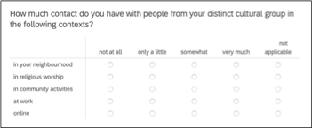
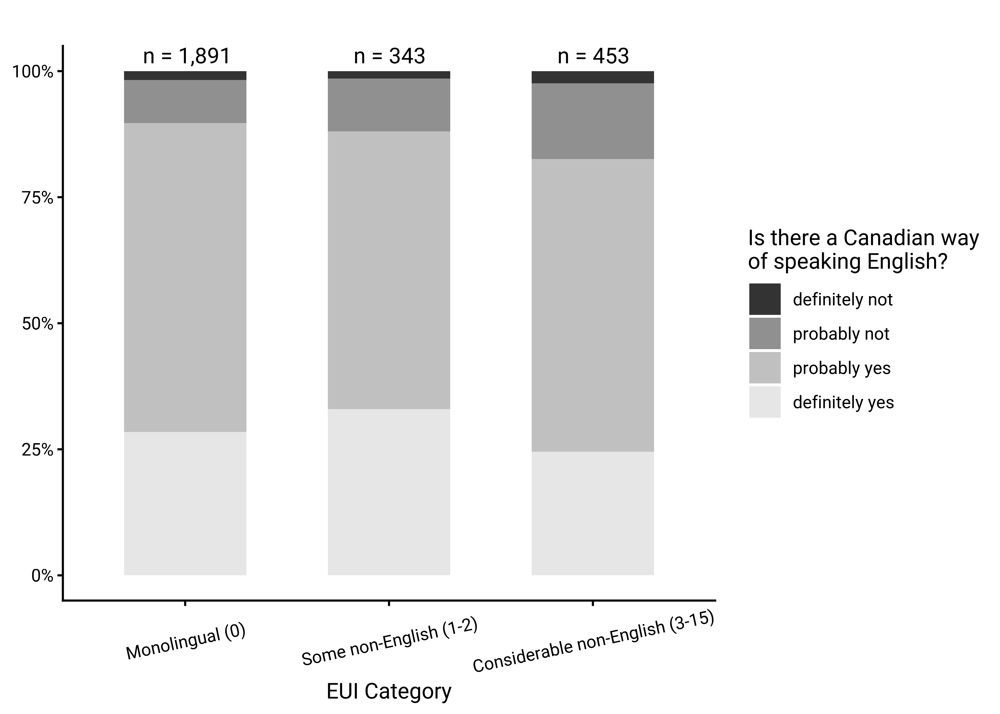
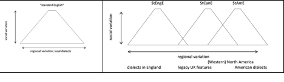

---

:::{.callout-info appearance="simple"}
**How to Cite**

Dollinger, S., &amp; Hinrichs, L. (2025). <em>Canadian language attitudes from “coast to coast to coast”: On the pluricentricity of English</em>. Manuscript. 
https://dollinger-hinrichs-2025.netlify.app.

To appear in J. Walker, D. Loakes and K. Gnevsheva (eds.), 2026. *Perceptions and attitudes in multilingual contexts*. Special issue, *Australian Journal of Linguistics*. 
:::

---

:::{.callout-tip appearance="simple"}
Download all plot-figures in print-ready quality (greyscale, 600 dpi) [here](https://utexas-my.sharepoint.com/:f:/g/personal/lh9896_eid_utexas_edu/EnJQcehIIhtCgEJanKV56boBVyM8lC9i0OaoCNQT-DRP7A?e=RU3nfO).
:::

# Introduction

The present paper explores key aspects of the linguistic autonomy and the character, recognition and social embedding of "Standard Canadian English". A focus on the standard of a given context, its conceptualization, perception and discursive construction is sociolinguistically relevant for several reasons. One can argue that attitudes towards a standard variety shape other aspects of linguistic practice. As sociolinguists are not immune to wider social developments we may expect shifting interpretations over time. For instance, while the first generation of Canadian linguists tended to emphasize differences between Canadian English and other varieties, above all American English (e.g. Avis et al. 1967, Scargill 1974), the linguistics of Canadian English has seen a different effect in the era of the free trade negotiations of the 1980s and early 1990s^[Fn. 1 omitted.]. This period was marked by statements as to the weakness of Canada-US border as a linguistic divide (e.g. Chambers 1980, Warkentyne & Brett 1981: 307, Warkentyne 1983: 73), or even to its irrelevance (e.g. Woods 1993: 174). The latter point is only occasionally echoed in more recent writings (e.g. Sadlier-Brown 2012: 547).

What generally unites these claims, however, is the lack of a comparative US sample in addition to Canadian samples, which means that US usage is inferred from circumstantial evidence (e.g. dictionary and usage guides, or general impressions) but not based on data collected in the same way as on the Canadian side. Whenever a more rigorous design is brought to study cross-border linguistic influences, however, the relevance of the Canada-US border is shown and its linguistic effects – subtle yet consistent – become evident (e.g. Chambers 1994, 2000; Boberg 2000, Boberg 2005, Boberg 2008; Dollinger 2012) and the pluricentric character of North American English – with a dominant US Standard and a non-dominant Canadian Standard – is accepted.

By "pluricentric" we refer to pluricentric theory as applied by Clyne (1995) and Muhr (2025). A pluricentric language is defined as "a language with several interacting centres, each providing a national variety with at least some of its own (codified) norms" (Clyne 1995: 20). The notion of centre is to be taken in an abstract manner, there is not need for a physical centre (as in Canada), though there often is. In the context of pluricentric languages, it is noteworthy that "contiguous varieties" of the same language, such as Canadian and American English, or, in the European context, Austrian German and German German or Netherlandic and Belgian Dutch, have traditionally been faced with disciplinary scepticism that questions the reality of younger linguistic varieties varieties (e.g. Scherr & Ziegler 2023).

By contrast, "non-contiguous varieties", i.e. those separated by a sea border such as Australian and New Zealand English, or Irish English and English English, have been recognized as autonomous more easily. Such questions of dominance (heteronomy) or non-dominance (autonomy) are part and parcel of the sociolinguistic theory of linguistic pluricentricity (e.g. Clyne 1984, 1995, Muhr 2012, Dollinger 2019b). The terms "dominant" and "non-dominant" derive from Clyne (1995) to express that the social fact that the "relation \[between pluricentric varieties\] is usually asymmetric and the norms of the dominant variety are preferred" in some contexts (Muhr 2025: 17-18).

Based on a language attitudinal questionnaire, the present paper explores notions of the "standard" for Canadian English and notions of linguistic autonomy as central tenets of pluricentric theory. It is structured in the following way: after a brief overview of existing attitudinal work on Canadian English, we will first introduce the present data set, collected in late 2023. We will then discuss the main results, correlations and modelling effects for the 3000-respondent-survey. In a next step, the findings will be placed into the context of existing literature on language attitudes and perceptions and Canadian English, before they are interpreted in the larger framework of the sociolinguistic theory of pluricentricity. It will be highlighted that pluricentricity has been the dominant approach in the sociolinguistics of World Englishes and that other concepts, purported to stand in competition or to "complement" pluricentricity, appear in philological frames that not only face decolonial or dehegemonic challenges (e.g. Oakes 2021, Dollinger 2025a, 2025b) but that appear to be epistemologically fraught (Dollinger 2019b).

As pluricentric modelling does not lend itself well to data-driven perspectives that disregard the social salience of variables and speaker attitudes (e.g. Elspaß et al. 2025, Scherr & Ziegler 2023), we recognize the central role of speakers’ emic perspectives, i.e. the cognitive representation of multiple standard varieties in North America, in addition to etic dimension, i.e. linguistic production. Following de Cillia & Ransmayr (2019), we employ non-linguistic terminology in our questions to probe the identification, conceptualization, and acceptance of a non-dominant standard variety, in our case Standard Canadian English (StCanE) in opposition to Standard American English, as indicative of multiple standards and thus linguistic pluricentricity in North America.

# Literature

Following Leitner (1992), two English varieties can be considered dominant today: Standard English English and Standard American English. All other varieties, including Standard Canadian English, are non-dominant varieties (e.g. Clyne 1992, originally called "non-dominant" "other" varieties) and are particularly prone to the effects of linguistic insecurity (Preston 2013). It is one purpose of this study to assess the belief of Canadians in the linguistic autonomy of their own standard, Standard Canadian English.

A few studies have hitherto investigated the phenomenon of linguistic attitudes and have either focussed on impressionistic assessment or on the linguistic insecurity among Canadian English speakers. Chambers (1986) surmises that Canadians, because of a higher degree of variation in spelling across provinces, are generally not favourable towards linguistic standards. Attitudinal data at the time suggested that Canadian English was orienting towards an American Standard in the early 1980s, although 1 in 4 Winnipeggers still considered the British form as "correct" (Owens and Baker 1984: 349).

Earlier attitudinal work sought to correlate measurements of attitudes towards country and statehood with linguistic features. Warkentyne (1983) and Gulden (1979) report on the same study, conducted in 1977 at the University of Victoria undergraduate in linguistics cohort. Gulden (1979: 45) reports on 64 students, while Warkentyne (1983: 72) speaks of "68 Canadian-born in two introductory English linguistics courses", and "most of them indicated" to be "preparing for a career as teachers of English" (Gulden 1979: 45). Their results, however, are completely identical.

## The 1977 UVic student study

The UVic study assessed on the one hand respondents’ general attitudes towards Canada, the US and the UK and on the other measured more specifically Canadian national identity with three questions:

a. questions about an obligation to buy Canadian products,
b. an evaluation of Canadian-produced TV programmes,
c. and a direct question about the existence of a Canadian national identity
(Gulden 1979: 57)

The study assessed attitudes on a scale from -1 (negative) to +1 (positive). General national identity was assessed at +0.292, so slightly positive in this student cohort of a median age of 23, while for the linguistic items the score was lower with +0.193, leading the researchers to conclude that "This group of Canadians does not feel very strongly about speaking a distinctive variety of English called Canadian English" (Gulden 1979: 58, Warkentyne 1983: 73, Table 1). The linguistic assessment was based on the following questions:

d. Is the language of CBC announcers the standard for spoken Canadian English?
e. Should a Canadian be offended if people from other countries consider him to be an American?
f. How should he feel if taken for British?
g. Does it make sense at all to speak of Canadian English as different from American and British English?

Answer options appeared in six intervals from -1 (negative) to +1 (positive). Some of these questions appear somewhat loaded ("does it make sense at all"; would a classification of Canadians as Americans "offend" a Canadian). In our questionnaire, similar questions were used in the present study with there-extrapositions or Yes/No questions on Likert scales.

Interesting in this context is the finding that questions "asking about Canadian identity directly show the most positive answers" (ibid: 58), which would relate to questions \[c\] and \[g\] above. For question \[c\] the value is +0.563, for the linguistic identity, \[g\], it is +0.344. It is possible that the rather negative framing of \[g\] underreported linguistic identity assessments, leading Gulden to summarize that "Canadians, or at least the present group, seem to believe in their national and linguistic identity, possibly more so than the low value of the entire \[compound\] variable would suggest" (ibid: 58) and lists as possible causes "an unfortunate choice of questions and/or by intervening factors such as modesty or insecurity" (ibid: 109). We have reason to assume that linguistic insecurity needs to be mitigated against, especially in non-dominant standard variety settings, such as Canadian English.

The study’s general national identity results, however, do not always fare positively for Canadian-ness. As Table 1 shows, the teacher’s degree students rated the U.S. "higher as a country in general" over Canada (ibid: 115), and, more strongly so, the U.K. over Canada and the U.K over the US:

:::{.callout-note appearance="simple"}
Table 1 omitted
:::

**Table 1: Attitudinal ratings in 1977, UVic students (Warkentyne 1983: Table 1)** 

The fourth line in the preference ratings refers to impressions of the perceived benefits that an association with the UK or the US offers to Canada. In 1977, this sample was clearly on the UK side. More generally, British people were rated more positively than Canadian people, but the Americans the lowest. Warkentyne comments that the "low scores on the items concerning Canadian identity should allay any fears that nationalism may be carried to the extreme" (1983: 73). Discussing correlations, including those about self-ratings and satisfaction in general, Gulden concludes "a striking combination": "those who do not have a very high opinion of themselves or any other people (except Americans) are more likely to favour the U.S. over the U.K." and those who show a high self-evaluation "are correlated with a preference for the U.K. over the U.S." (ibid: 123-4).


## The 2000s: An increase of Canadian linguistic awareness

A generation later, studies that use direct questions to assess respondents’ attitudes towards linguistic autonomy found that scores had markedly improved, with considerable majorities offering affirmative responses. A 2009 Vancouver study found that:

-  81% believed that "there is a Canadian way of speaking English"

-  73% claimed to be able to "tell Canadian English speakers from American English speakers"

-  69% considered "Canadian English are part of \[their\] Canadian identity"

-  74% wanted Canadian English "taught in schools, using Canadian dictionaries, grammars etc." (2009 data, Dollinger 2020: Table 4.5)

Positive assessment can also be seen in terms of domestic linguistic attitudes. McKinnie & Dailey-O’Cain (2002) polled Ontarians’ and Albertans’ assessments of "pleasantness" and "correctness" of varieties of Canadian English. In terms of "correctness", both Albertans and Ontarians consider BC English as most correct (ibid: 283). A paper on 6–12-year-old elementary students and their parents in BC and Alberta found that 69% considered the Standard Canadian English speaker as "sounding Canadian", while the Mandarin and Cantonese-accented speaker scored 26 and 23% respectively (Dollinger, Chan, Pasula & Maag 2024: 326). This difference shows "a bias towards a StCanE accent which we attribute to the forcefulness of standard language ideology in Canada" (ibid). It was also shown that "the multilingual speaker is less tolerant towards L2-accented English than monolingual speakers" (ibid: 329).

What is available to date for assessments of Standard Canadian English are province-related findings from Manitoba, Alberta, Ontario and BC, but no study of national scope. One recent exception is Freake (2023: 196-7), a perceptual dialectology and language regard study on Canadian English with a national sample, confirming perceived dialect regions within the country. The present study hits in the same curb by offering solid data from all provinces and territories. It intends to gauge to what degree "Canadian English has become a reality for many of its speakers" (Dollinger 2019a: 224).

# The Data

The data was collected with a questionnaire of 25 language attitude and usage questions, which was complemented by 14 social background question. Data was collected with 18 students in an upper level English linguistics seminar at UBC (ENGL 489, Language Majors Seminar) in November and December 2023. The questionnaire can be accessed online. Over 3000 responses were collected, from all ten provinces and three territories, of which up to 3001 were used in the analysis. Table 1 shows the absolute numbers of responses by place of residence (Live now) and formative region, that is the region in which at least 9 years during the formative years 0-18 were spent. Because of low returns from residents of the territories (one from Nunavut (1) and case numbers in the mid-teens from Yukon and Northwest Territories), we created a class for "north of sixty" (degrees of latitude) territories, TR.

:::{.callout-note appearance="simple"}
Table 2 omitted
:::

**Table 2: Absolute frequencies: locations**


Response numbers by age and gender are depicted in Figure 1. As can be seen, the cohort 20-24 is best represented, with females typically outnumbering males. Non-binary respondents are best represented in the cohorts from 20-49.

```{r}
#| label: setup
#| include: false

library(pacman)
p_load(rio, tidyverse, 
       janitor, gt, tm,
       patchwork, showtext,
       sysfonts
       )

font_add_google("Roboto", "roboto")
showtext_auto()

activate_fonts_for_saving <- function() {
  font_add_google("Roboto", "roboto")
  showtext_auto()
  showtext_opts(dpi = 600)
  }

df <- import("data/df_cleaned_5.rds", trust=T) %>% 
  as_tibble() 

# Define two groups of selectors for region (where spent formative years) and province (of current residence).
can_regions <- c("BC", "AB", "SK", "MB", "ON", "QC",
                  "NB", "NS", "PE", "NL", "TR", "US", "UK")
```


```{r}
#| label: fig-age-gender
#| fig-cap: "Distribution of age and gender among those whose formative years were spent in Canada."
#| echo: true
#| fig-width: 6
#| fig-height: 3

df_age <- df %>%                     # replace with your frame name
  filter(!is.na(age), !is.na(gender)) %>%
  mutate(
    gender = factor(gender,
                    levels = c("female", "male", "other"))
  )

# ── 2  count cases per age × gender ──────────────────────────────────────────
df_counts <- df_age %>%
  count(age, gender, name = "n")

# ── 3  line plot of raw counts ───────────────────────────────────────────────
ggplot(df_counts, aes(x = age, y = n, colour = gender)) +
  geom_line(linewidth = 2,
            alpha = 0.6) +
  
  # scale_colour_manual(
  #   values = c(
  #     "male" = "#0072B2",   # blue
  #     "female"   = "#E69F00",   # orange
  #     "other"  = "#CC79A7"    # magenta-purple
  #   ),
  #   name = NULL
  # ) +
  
  scale_color_grey(
    start=0.2, end=.9,
    name = NULL
    ) +

  labs(
    x     = "Age",
    y     = "N respondents",
    title = ""
  ) +
  theme_classic(base_family = "roboto",
                base_size = 12) +
  theme(
    legend.text = element_text(family = "roboto"),    
    legend.title = element_text(family = "roboto"),
    plot.title.position = "plot"
    )

```

```{r}
#| label: "save-fig-1"
#| eval: false
#| echo: false

activate_fonts_for_saving()
ggsave("fig/fig-1.png", width = 7, height = 3.2, dpi = 600)
```


# Results & Discussion

In the first section we aim to connect public discourse and use of language reference tools with language attitudinal data. We will use several single variables and some indices that will, overall, allow us to interpret the strength of the notion of "Canadian English" as a standard variety in the minds of its speakers and with it the role of the pluricentricity of English in North America.

## Attitudinal autonomy in CanE

Figure 2 offers an overview of six key questions which were asked of Canadian residents (this includes transient residents, e.g. foreign students). Combining the answers of "Definitely yes" and "Probably yes", the notion of an autonomously "Canadian way of speaking" is confirmed by 70.1%, with 9% undecided. Compared with 81.1% from 2009 from a six-point scale, the present five-point scale probably more closely reflects the actual state of attitudes. Similar percentages, 68% see CanE as a "distinct kind of English", like American or British English. On the question of spelling, the sample is more divided, with more undecided ones (26.4%) than definite yeses (24.8%). This is somewhat add odds with almost 39% "definitely" confirming that Canadian universities should encourage Canadian spelling and a clear 78% wish to have a Canadian spelling option in software applications, with 12% undecided. Lastly, in terms of a free digital dictionary of CanE, nearly 71% claim they would use it.

:::{.callout-warning}
## To Stefan

I have selected the following variables by short names, hoping that these are the correct ones to show in Figure 2. 

```{r}
#| label: select-vars
#| echo: false

source("gt_bold.R")

myvars_short <- df %>% 
  colnames() %>% 
  .[c(21, 28, 15, 13, 14, 20)]

myvars_long <- c(
  "Currently, there exists no digital English dictionary for Canada. If freely
available, would you use an online dictionary of Canadian English?",
"In your opinion, is there a Canadian way of speaking English?",
"In your opinion, is Canadian English a distinct kind of English (e.g. similar to
American English being distinct from British English)?",
"Do you think that Canadian spelling is important (e.g. \"colour\" instead of
\"color\", \"familiarize\" not \"familiarise\")?",
"Do you think Canadian university departments should encourage Canadian
English spelling in academic work?",
"Do you think that language settings in software should include an option for
Canadian English? (e.g. text processing, Grammarly etc.)"
)

tibble(`Q. short` = myvars_short, 
       `Q. long`  = myvars_long
       ) %>% 
  gt_bold()

```
:::


```{r}
#| label: fig-various-questions-on-autonomy
#| fig-cap: "Likert-scale responses to questions on the linguistic autonomy of CanE among the Canadian residents (2,723 ≤ *N* ≤ 2,813). (Percentage distribution of responses, NA values excluded per question.)"
#| eval: true
#| echo: true
#| fig-width: 9
#| fig-height: 3.2
#| column: page-left


# 1. Define variables, long labels, and color scheme
myvars_short <- c("dictionary", "cdn_way", "distinct", "spell", "spell_uni", "software")

# New: Shortened, Descriptive Question Labels (for facet titles)
question_long_names <- c(
  "dictionary"  = "Would you use a free digital\ndictionary of CanE?",
  "cdn_way"     = "Is there a Canadian way\nof speaking English?",
  "distinct"    = "Is Canadian English a distinct\nkind of English?",
  "spell"       = "Do you think Canadian\nspelling is important?",
  "spell_uni"   = "Should Cdn universities\nencourage Cdn English\nspelling?",
  "software"    = "Should software settings\ninclude a Canadian\nEnglish option?"
)

response_colors <- c(
  # Likert Scale (5 categories)
  "Definitely yes"    = "#0072B2",  # Male Blue for "Most Positive"
  "(Probably) yes"    = "#56B4E9",  # Lighter Blue
  "Neither yes or no" = "#CC79A7",  # Other Magenta for "Neutral"
  "(Probably) no"     = "#F0E442",  # Lighter Yellow/Orange
  "Definitely not"    = "#E69F00",  # Female Orange for "Most Negative"
  
  # Three-Way Response
  "Yes"               = "#0072B2",  # Male Blue for "Yes"
  "No"                = "#E69F00",  # Female Orange for "No"
  "Don't know"        = "#CC79A7"   # Other Magenta for "Uncertain"
)

response_colors_grey <- c(
  # Likert Scale (5 categories)
  "Definitely yes"    = "grey20",       # Most Positive → darkest
  "(Probably) yes"    = "grey35",
  "Neither yes or no" = "grey60",      # Neutral
  "(Probably) no"     = "grey80",
  "Definitely not"    = "white",       # Most Negative → lightest

  # Three-Way Response
  "Yes"               = "grey20",
  "No"                = "white",
  "Don't know"        = "grey60"
)


# Define the ordered factor levels for correct plotting sequence
# NOTE: These are the TARGET levels after remapping
likert_levels <- c("Definitely not", "(Probably) no", "Neither yes or no", "(Probably) yes", "Definitely yes")
three_way_levels <- c("No", "Don't know", "Yes")

# 2. Define the response standardization function (unchanged)
standardize_responses <- function(question, response) {
  case_when(
    # Q4: Spell (Importance Scale) remapping to Likert
    question == "spell" ~ case_when(
      response == "very important" ~ "Definitely yes",
      response == "important" ~ "(Probably) yes",
      response == "neither unimportant nor important" ~ "Neither yes or no",
      response == "unimportant" ~ "(Probably) no",
      response == "very unimportant" ~ "Definitely not",
      .default = response
    ),
    
    # Q1: Dictionary (6 levels) remapping to 5-level Likert
    question == "dictionary" ~ case_when(
      response == "definitely yes" ~ "Definitely yes",
      response == "yes" ~ "(Probably) yes",
      response == "neither yes or no" ~ "Neither yes or no",
      response == "no" ~ "(Probably) no",
      response == "definitely not" ~ "Definitely not",
      .default = response # Keep NA or other unrecognized as is
    ),
    
    # Q5: Spell_uni (6 levels) remapping to 5-level Likert
    question == "spell_uni" ~ case_when(
      response == "definitely yes" ~ "Definitely yes",
      response == "probably yes" ~ "(Probably) yes",
      response == "might or might not" ~ "Neither yes or no",
      response == "probably not" ~ "(Probably) no",
      response == "definitely not" ~ "Definitely not",
      .default = response
    ),
    
    # Q2 & Q3: cdn_way & distinct (4 levels) remapping to 5-level Likert
    question %in% c("cdn_way", "distinct") ~ case_when(
      response == "definitely yes" ~ "Definitely yes",
      response == "probably yes" ~ "(Probably) yes",
      response == "probably not" ~ "(Probably) no",
      response == "definitely not" ~ "Definitely not",
      .default = response # Keep NA
    ),
    
    # Q6: Software (Binary/Categorical) remapping for capitalization
    question == "software" ~ case_when(
      response == "yes" ~ "Yes",
      response == "no" ~ "No",
      .default = response
    ),
    
    .default = response
  )
}


# 3. Data Transformation (Wide to Long, Summarize, and Calculate Percentages)
df_long_summary <- df %>% 
  pivot_longer(
    cols = all_of(myvars_short),
    names_to = "Question_Short", 
    values_to = "Response_Original"
  ) %>%
  
  # Apply the Standardization Mapping
  mutate(
    Response = standardize_responses(Question_Short, Response_Original)
  ) %>%
  
  # Exclude NA responses as requested
  filter(!is.na(Response)) %>%
  
  # Ensure the standardized responses have correct factor levels
  mutate(
    Response = factor(Response, 
                      levels = c(likert_levels, three_way_levels), 
                      ordered = TRUE),
    
    # Assign the new, long labels as factor labels for faceting
    Question = factor(Question_Short, 
                      levels = myvars_short, 
                      labels = question_long_names)
  ) %>%
  
  # Group and calculate counts and percentages
  group_by(Question, Response, Question_Short) %>% 
  summarise(Count = n(), .groups = 'drop') %>%
  group_by(Question) %>%
  mutate(
    Total = sum(Count),
    Percentage = Count / Total,
    # Create the percentage label text
    Percent_Label = scales::percent(Percentage, accuracy = 1)
  ) %>%
  ungroup()

# 4. Create the ggplot
p <- df_long_summary %>%
  ggplot(aes(x = Response, y = Percentage, fill = Response)) +
  
  # Bars representing the percentage
  geom_col(width = 0.6, , color="grey30") +
  
  geom_text(aes(label = Percent_Label),
            family = "roboto",
            vjust = -0.5, 
            size = 3.5) +
  
  geom_text(family = "roboto",
            data = . %>% filter(Question_Short == "software"), 
            
            aes(label = Response, y = Percentage / 2), 
            color = "white",
            fontface = "bold",
            size = 3.5) +
  # ----------------------------------------------------
  
  # Faceting: 1 row, 6 columns, free x-axes for different number of bars
  facet_wrap(~ Question, 
             ncol = 6, 
             scales = "free_x",
             strip.position = "bottom") + 
  
  # Apply the custom harmonized color scale
  scale_fill_manual(
    values = response_colors_grey,
    breaks = likert_levels, 
    drop = TRUE
  ) +
  
  # Y-axis formatting: show as percentage
  scale_y_continuous(
    labels = scales::percent_format(accuracy = 1),
    expand = expansion(mult = c(0, 0.15))
  ) +
  
  # Theme and Labels
  labs(
    title = "",
    subtitle = "",
    x = NULL,
    y = NULL, 
    fill = NULL 
  ) +
  
  # Custom theming for presentation
  theme_classic(base_family = "roboto",
                base_size = 12) +
  theme(
    legend.text = element_text(family = "roboto"),    
    # legend.title = element_text(family = "roboto"),
    axis.line.y = element_blank(),
    axis.ticks.y = element_blank(),
    axis.text.y = element_blank(),
    axis.text.x = element_blank(), 
    axis.ticks.x = element_blank(),
    axis.line = element_blank(),

    
    # Legend at the top, horizontal, centered
    legend.position = "top",
    legend.justification = "center",
    legend.direction = "horizontal",
    legend.title = element_blank(), 
    
    # Clean up facet strips (Question labels underneath)
    strip.background = element_blank(),
    strip.text = element_text(face = "bold", size = 7.2, hjust = 0.5)
    # ,
    # plot.title = element_text(face = "bold")
  )

print(p)
```


```{r}
#| label: "save-fig-2"
#| eval: false
#| echo: false

activate_fonts_for_saving() 
ggsave("fig/fig-2.png", width = 10.2, height = 4.1, dpi = 600)
```


With such answers the linguistic autonomy of Standard Canadian English seems well enshrined at this point, confirming the 2009 data overall and showing considerable differentiation from the early 1980s, when "Americanization " was the most virulently discussed attribute of Canadian English. This change in outlook is remarkable and warrants a closer look at the social distribution of those who recognize Canadian English – most commonly through its standard that had been documented and fully codified as a distinct variety of English by 1967 (Gregg 1993, Dollinger 2019: 131-32). 

## Familiarity with "Standard Canadian English" 

While "Canadian English ", as a slur, dates to 1857 (DCHP-3, s.v. "Canadian English"), "Standard Canadian English" (StCanE) is a concept that has been discussed in linguistic circles only since the 1970s. It is in pluricentric theory the key concept whose understanding is a *sine-qua-non* for an appreciation of the linguistic autonomy of a variety, i.e. Canadian English. In the public and in schooling, however, uptake of StCanE as a term and autonomous concepts has been slower. While the public perception of a "Canadian English" has been strong, related discourse is subject to considerable fluctuation. Figure 3 (left) shows data to that effect, which compares the use of Canadian dictionary titles in domestic media since the 1970s with the frequencies of the term "Canadian English" ("Canadian Newsstream" database) from 1980 to the end of 2024, shown in Figure 3 (right).

```{r}
#| label: fig-placeholder
#| fig-cap: "Placeholder: Figure caption will go here."
#| echo: true
#| eval: false
#| include: false
#| fig-alt: "Description of the final figure."

```

In general, the 1980s and 1990s were a period of increasing language awareness in Canada, with the uptake of Canadian dictionary titles lagging behind an increase or decrease of the phrase "Canadian English" in the media by a period of five years. The more the concept is discussed, the more Canadian dictionary titles are used as reference sources in the media. The years 1996-1998 have been the most productive years in Canadian English dictionary publishing so far, with four full-size titles appearing. The sole winner, the *Canadian Oxford Dictionary* of this Canadian dictionary war, however, was shut down in 2008, which led to US titles being the most prevalent ones, as Figure 3 (left) shows. Today, the *Canadian English Dictionary* is scheduled to take over that function when finished (Chew 2025).

```{r}
#| label: fig-dictionaries
#| fig-cap: "Canadian dictionary titles and the phrase “Canadian English” in the Canadian press, 1977-2024."
#| eval: true
#| echo: true
#| fig-width: 11
#| fig-height: 4.9
#| column: page-left
#| message: false
#| warning: false


dat1 <- import("data/data_fig_3_1.csv", header = TRUE) 
  rownames(dat1) <- dat1[[1]]
  dat1 <- dat1[-1]
  dat1 <- dat1 %>% t() %>% as.data.frame()
  dat1 <- dat1 %>% 
    rownames_to_column(var = "period") %>% 
    pivot_longer(cols = (2:4), 
                 names_to = "dictionary",
                 values_to = "frequency"
                   )

dat2 <- import("data/data_fig_3_2.csv", header = TRUE) %>% 
  t() %>% 
  as.data.frame() %>% 
  slice(2:n()) %>% 
  rename(frequency = 1) %>% 
  rownames_to_column(var = "period") %>% 
  mutate(frequency = as.numeric(frequency))

p1 <- 
  dat1 %>% 
  ggplot(aes(period, 
             frequency, 
             colour = dictionary,
             group = dictionary
             )
         ) +
  geom_line(linewidth = 2
            ) +
  labs(
    title = "\"Canadian English\" in dictionaries, 1977-2024",
    x=NULL,
    y=NULL
  ) +
  scale_color_grey(start = 0.3, end = 0.85,
                   name = NULL
                   ) +
  theme_classic(base_family = "roboto") +
  theme(
    legend.text = element_text(family = "roboto"),    
    legend.title = element_text(family = "roboto"),
    legend.position = "bottom"
    )

p2 <- 
  dat2 %>% 
  ggplot(aes(period, frequency, group=1)) +
  geom_line(linewidth = 2, color="grey35") +
  geom_label(aes(label = frequency), 
             vjust = -0.5,
             size = 3
             ) +
  labs(
    title = "\"Canadian English\" in the press, 1980-2024",
    x=NULL,
    y=NULL
  ) +
  theme_classic(base_family = "roboto") +
  theme(
    legend.text = element_text(family = "roboto"),    
    legend.title = element_text(family = "roboto")
  ) +
  scale_y_continuous(expand = expansion(mult = c(0.05, 0.15)))


combined_plot <- p1 + p2 + plot_layout(ncol = 2)
combined_plot

```

```{r}
#| label: "save-fig-3"
#| eval: false
#| echo: false

activate_fonts_for_saving() 
ggsave("fig/fig-3.png", width = 11, height = 4.9, dpi = 600)
```


That is as much detail as can be extracted from corpus searches. We aim use the current study to fill in some gaps in interpretation. Figure 4 summarizes the respondent’s general familiarity with the term "Standard Canadian English" or "Canadian Standard English" by region, that is by their formative years ("have you heard of the term…"). We assigned a province/territory or country to those who spent at least nine years in their ages 0-18 in one location and show the Canadian as well as the US and UK responses for comparison.

```{r}
#| label: fig-stheard-by-region
#| fig-cap: >
#|   Responses to "Have you heard of the term '(Standard) Canadian English'?" by region of formative years. 
#| eval: true
#| echo: true
#| fig-width: 9
#| fig-height: 6.2
#| column: page-left

# Filter out 'not sure' responses and keep only 'yes' and 'no'
df_filtered <- df %>% 
  filter(
    !region=="other",
    st_heard %in% c("yes", "no")
    )

# Group by region and st_heard to get counts
df_counts <- df_filtered %>%
  group_by(region, st_heard) %>%
  summarise(n = n(), .groups = "drop") %>%
  spread(st_heard, n, fill = 0)

# Perform chi-square test for each region, excluding regions with zero counts for either 'yes' or 'no'
chi_square_results <- df_counts %>%
  filter(yes > 0 & no > 0) %>%
  rowwise() %>%
  mutate(chi2_test = list(janitor::chisq.test(c(yes, no))),
         chi2 = chi2_test$statistic) %>% 
  mutate(p_value = chi2_test$p.value,
         significance = case_when(
           p_value < 0.0001 ~ "****",
           p_value < 0.001 ~ "***",
           p_value < 0.01 ~ "**",
           p_value < 0.05 ~ "*",
           TRUE ~ ""
         ),
         p_value = sprintf("%.4f", chi2_test$p.value)
         ) %>%
  select(region, chi2, p_value, significance)

# Filter out 'not sure' responses and keep only 'yes' and 'no'
df_filtered <- df %>% 
  filter(!region=="other",
         !is.na(st_heard))

# Group by region and st_heard to get counts
df_counts <- df_filtered %>%
  group_by(region, st_heard) %>%
  summarise(n = n(), .groups = "drop") %>%
  spread(st_heard, n, fill = 0)

# Plotting the data
df_percent <- df_filtered %>%
  group_by(region, st_heard) %>%
  summarise(n = n(), .groups = "drop") %>%
  group_by(region) %>%
  mutate(percent = n / sum(n) * 100)

region_counts <- df_filtered %>%
  group_by(region) %>%
  summarise(n_total = n())

df_percent_labeled <- df_percent %>%
  left_join(region_counts, by = "region") %>%
  mutate(region_label = paste0(region, " (n=", n_total, ")"))

# Merge chi-square results with df_percent_labeled
df_percent_labeled <- df_percent_labeled %>%
  left_join(chi_square_results, by = "region") %>% 
  mutate(region_label = paste0(region_label, " ", significance))

# Plot
p3 <- ggplot(df_percent_labeled, aes(x = st_heard, y = percent, fill = st_heard)) +
  geom_bar(stat = "identity", width = .55, color="grey30") +
  facet_wrap(~ region_label, ncol = 5) +
  #geom_text(aes(x = 1.5, y = 100, label = paste0("n = ", n_total, "\n", "sig.: ", significance)), inherit.aes = FALSE, size = 3) +
  labs(title = "Have you heard of the term \"(Standard) Canadian English\"?",
       subtitle = "Region of formative years",
       caption = "Significance coding based on chi-square test of the distribution of \"yes\" vs. \"no\" responses\np < 0.0001 ~ ****, p < 0.001 ~ ***, p < 0.01 ~ **, p < 0.05 ~ *",
       y = NULL, x = NULL, fill = NULL) +
  scale_y_continuous(labels = scales::percent_format(scale = 1),
                     limits = c(0, 75)) +
  theme_classic(base_family = "roboto") +
  theme(
    legend.text = element_text(family = "roboto"),    
    legend.title = element_text(family = "roboto"),
    legend.position = "none",
    plot.title.position = "plot",
    plot.caption.position = "plot",
    plot.caption = element_text(hjust = 0),
    strip.background = element_rect(fill = "grey30", color = "grey30"), 
    strip.text = element_text(color = "white",
                              face = "bold")
    )

# p3 + scale_fill_manual(values = c("#E69F00", "#0072B2", "#F0E442", "#D55E00", "#CC79A7")) 
p3 + scale_fill_grey(start=0.15, end=.85)

```


```{r}
#| label: "save-fig-4"
#| eval: false
#| echo: false

activate_fonts_for_saving() 
ggsave("fig/fig-4.png", width = 9, height = 6.2, dpi = 600)
```


Figure 4 depicts the 10 Canadian provinces (BC to NL) and one plot for the three Canadian Territories (TR), completed by the UK and US respondents. Most often respondents reported having heard the term "(Standard) Canadian English" in New Brunswick (NB), followed by Ontario (ON), British Columbia (BC), Alberta (AB), Quebec (QC), Manitoba, Sasktachewan. These seven provinces show significant differences between yes and no. The Maritime provinces, Nova Scotia (NS) do not reach significance, though more have heard the term, while in Prince Edward Island (PEI) those who haven’t heard are in the majority, there’s a tie in the Territories (TR). The UK respondents are more exposed to the term than people raised in Manitoba (MB), Newfoundland and Labrador (NL) and [Saskatchewan (SK)]{.underline}.

The Americans (US) in our sample, all of whom likely with some ties to Canada as an artefact of our data collection method (snowball method), are more familiar with the term than Nova Scotians (NS) and Prince Edward Islanders (PE). The assumption is that if speakers are familiar with Standard Canadian English they are more likely to comprehend the social relevance of the variety as a marker of identity. Such awareness would therefore be strongest in New Brunswick (which sets it apart from the other Atlantic Provinces NS, PE and NL), followed by Ontario, then BC and Alberta.

Figure 5 shows exposure to "Standard Canadian English" with respondents’ status of multilingualism. Monolingual speakers, socialized in Canada, are significantly less likely to "have heard" of "Standard Canadian English" or "Canadian Standard English". Monolinguals are more likely to have a "default" of "English unspecified" as a variety and need to learn to appreciate the special characteristics of Standard Canadian English.

```{r}
#| label: fig-stheard-by-multiling
#| fig-cap: >
#|   Responses to "Have you heard of the term '(Standard) Canadian English'?" by linguistic background.
#| eval: true
#| echo: true
#| fig-width: 6
#| fig-height: 3.5
#| message: false
#| warning: false

df_filtered <- df %>% 
  filter(!region=="other",
         !province %in% c("United States", "other"),
         !is.na(st_heard),
         !is.na(umultiling))

df_plot_data <- df_filtered %>%
  count(umultiling, st_heard) %>%
  group_by(umultiling) %>%
  mutate(
    Percentage = n / sum(n), # Calculate percentage within each st_heard group
    N_Label = n
  ) %>%
  ungroup()

df_plot_data %>%
  ggplot(aes(x = st_heard, y = Percentage, fill = umultiling)) +
  
  geom_col(width = 0.5, position = "dodge", color="grey30") +
  
  geom_text(aes(label = N_Label),
    position = position_dodge(width = 0.5),
    vjust = -0.5,
    size = 3.5,
    family = "roboto"
  ) +
  
  # scale_fill_manual(
  #   values = c("#F0E442", "#D55E00"),
  #   labels = c("monolingual (n=1,242)", "bi- or multilingual (n=1,083)") 
  # ) +
  
  scale_fill_manual(
      values = c("grey80", "grey30"),  
      labels = c("monolingual (n=1,242)", "bi- or multilingual (n=1,083)")
    ) +
  
  coord_cartesian(ylim = c(0, 0.65)) +
  
  scale_y_continuous(
    labels = scales::percent
  ) +
  
  labs(fill = "Linguistic Background",
       caption = "Bar height corresponds to %.",
       y = NULL,
       x = NULL) +

  theme_classic(base_family = "roboto") +
  theme(
    legend.text = element_text(family = "roboto"),    
    legend.title = element_text(family = "roboto"),
  )

```

```{r}
#| label: "save-fig-5"
#| eval: false
#| echo: false

activate_fonts_for_saving() 
ggsave("fig/fig-5.png", width = 6, height = 3.2, dpi = 600)
```


Figure 5 shows that Multilinguals who were raised in Canada are significantly more likely than Monolinguals to have heard about (Standard) CanE. What, however, do they understand by the term, which is used in specialist circles, but very little in public discourse today (Figure 3 right, 2020-24 period)?

An open answer field solicited definitions of Standard Canadian English, with the options to decline ("don’t know what it is", "do know it but cannot describe it well"), was designed to yield only the answers of the confident respondents in that aspect, some of which are reproduced in Table 2 below:

:::{.callout-note appearance="simple"}
Table 3 omitted
:::

**Table 3: Select responses to the question "Do you know what "Standard Canadian English" is?**

Of the ten descriptions of Standard Canadian English, notions of widespread use (1, 4, 6), media (2, 4, 7, 9), more British influence (5), a regional dimension (8) and socialization in Canada (10) are recurring themes, with occasional sceptics (3). What is striking is that the attribute of "educated", normally a mainstay in standard variety definitions, is absent. Trudgill & Hannah (2017: 6) speak of a "North American English (NAmEng), meaning English as written and spoken by educated speakers in the United States of America and Canada", though a definition rooted in educated speech does not feature prominently in the responses, with only three in the entire sample mentioning "educated" speakers.

The next question asked, "Do you know what ‘Standard Canadian English’ (or ‘Canadian Standard English’) is?". Figure 6 only shows the ones that were able to answer "Yes" to that question. There were two Yes-categories: "Yes, but I can’t describe it well" and those that did offer a description (n for both Yes-categories was 1513 or 48.2%). While the data in Figure 6 is significant for age, visual inspection shows that starting at 25-29 virtually no change is visible in the two lines. This means that the youngest age cohorts 14 and under, 15-19 and 20-24 are the ones that produce significance for age. In other words: once the university years are over and basic education is completed, there is no change in knowledge about the standard: only some 25% of those how know what Standard Canadian English is are able to describe it in some form.

```{r}
#| label: fig-describe-StCanE
#| fig-cap: "Probabilities of being able to describe the standard (lower line) and of self-reported familiarity with the concept but inability to describe it."
#| eval: true
#| echo: true
#| fig-width: 6
#| fig-height: 3.5
#| message: false
#| warning: false

df_plot <- df %>%  
  filter(!is.na(st_descr), !is.na(age)) %>%
  mutate(st_descr = droplevels(factor(st_descr))) 
lev <- levels(df_plot$st_descr)   

# ── 2  build a binary indicator for the 2nd level (pick either level as "1") --
df_plot <- df_plot %>%
  mutate(is_lvl2 = as.numeric(st_descr == lev[2]))  

# ── 3  fit a loess to *all* points at once ------------------------------------
lo_fit <- loess(is_lvl2 ~ age, data = df_plot, span = 0.2)   

# prediction grid
grid  <- tibble(age = seq(min(df_plot$age),
                          max(df_plot$age), by = 1)) %>%
  mutate(
    prob_lvl2 = predict(lo_fit, newdata = .),
    prob_lvl1 = 1 - prob_lvl2
  ) %>%
  pivot_longer(cols = starts_with("prob_"),
               names_to = "st_descr", values_to = "prob") %>%
  
  mutate(
    st_descr = case_match(
      st_descr,
      "prob_lvl1" ~ "Yes, I know what it is.",
      "prob_lvl2" ~ "Yes, but I can't describe it well."
    ),
    st_descr = factor(st_descr) %>% fct_rev()
)


grid %>% 
  ggplot(aes(age, prob, colour = st_descr)) +
  geom_line(linewidth = 1.6) +
  scale_colour_grey(start=.2, end=.75, name = NULL) +
  labs(x = "Age",
       y = "Est. probability"
       ) +
  theme_classic(base_family = "roboto") +
  theme(
    legend.text = element_text(family = "roboto"),    
    legend.title = element_text(family = "roboto")
  )


```

```{r}
#| label: "save-fig-6"
#| eval: false
#| echo: false

activate_fonts_for_saving() 
ggsave("fig/fig-6.png", width = 6, height = 3.2, dpi = 600)
```


One additional issue is that the older teenagers are the age cohort that is the least likely to know what StCanE is. Only 10 of the 116 youngsters aged 15-19-years and socialized in Canada (162 overall, including newcomers) know what "Standard Canadian English" is, which raises the question how English is taught at Canadian schools, without using this key concept in pluricentric theory. Failure to teach the concept of linguistic pluricentricity in school may offer an explanation why the monolingual speakers (Figure 5) are less likely to have heard about StCanE than multilinguals, which leaves the monolinguals potential for linguistic identity formation untapped.

## "Canadian way" of speaking

Another way of gauging the awareness of StCanE is to ask about a "Canadian way" of speaking, (Dollinger 2020: 63, Table 4.5). Without using linguistic terminology of standard varieties, the respondents answer with a personal assessment or impression. Figure 7 shows the results for Canadian residents and those who spent their formative years in Canada (left). Those growing up in Canada see consistently more a "Canadian way of speaking". Figure 7 (right) divides the "formative years" on the left by gender, suggesting that females overall play a more important role than males in that process, with non-binaries numerally too weak to make a difference.

```{r}
#| label: fig-wayofspeaking-res-formativeyears
#| fig-cap: "\"Canadian way of speaking\" by residential biography (left) and gender (for respondents who spent formative years in Canada, right)."
#| eval: true
#| echo: true
#| fig-width: 11
#| fig-height: 4.9
#| message: false
#| warning: false
#| include: false

dat1 <- df %>% 
  filter(!is.na(cdn_way),
         !is.na(age)) %>% 
  mutate(
    formative_years_in_CA = if_else(
      !province %in% c("United States", "other"), TRUE, FALSE),
    cdn_way_yes = if_else(
      cdn_way == "definitely yes" | cdn_way == "probably yes", TRUE, FALSE
    )
  ) %>% 
  count(age, formative_years_in_CA, cdn_way_yes)


dat1_summary <- dat1 %>%
  group_by(age, formative_years_in_CA) %>%
  summarise(
    total = sum(n),
    true_count = sum(n[cdn_way_yes == TRUE]),
    false_count = sum(n[cdn_way_yes == FALSE]),
    percent_true = 100 * true_count / total,
    percent_false = 100 * false_count / total,
    .groups = "drop"
  ) %>% 
  filter(true_count > 0,
         false_count > 0)

p1 <- dat1_summary %>% 
  mutate(formative_years_in_CA = if_else(formative_years_in_CA,
    "spent formative years in Canada", "current resident of Canada"
  )) %>% 
  ggplot(aes(age, percent_true, 
             group = formative_years_in_CA, 
             color = formative_years_in_CA)) +
  # geom_smooth(se=F, linewidth = 2, span=.3) +
  geom_line(linewidth = 2) +
  scale_color_grey(name = NULL) +
  scale_y_continuous(limits = c(0, NA)) +
  labs(y=NULL) +
  theme_classic(base_family = "roboto") +
  theme(
    legend.text = element_text(family = "roboto", size = rel(1.15)),    
    legend.title = element_text(family = "roboto"),
    legend.position = "top"
    )


dat2 <- df %>% 
  filter(!is.na(cdn_way),
         !is.na(age),
         !province %in% c("United States", "other"),
         !gender == "other"
         ) %>% 
  mutate(cdn_way_yes = if_else(
      cdn_way == "definitely yes" | cdn_way == "probably yes", TRUE, FALSE
    )
  ) %>% 
  count(age, gender, cdn_way_yes) %>% 
  group_by(age, gender) %>%
  summarise(
    total = sum(n),
    true_count = sum(n[cdn_way_yes == TRUE]),
    false_count = sum(n[cdn_way_yes == FALSE]),
    percent_true = 100 * true_count / total,
    percent_false = 100 * false_count / total,
    .groups = "drop"
  ) %>% 
  filter(
    true_count > 0,
    false_count > 0
  )

p2 <- dat2 %>% 
  ggplot(aes(
    age, percent_true, 
    group = gender,
    color = gender
  )) +
  # geom_smooth(se=F, linewidth = 2, span=.2) +
  geom_line(linewidth = 2) +
  scale_color_grey(name = NULL) +
  scale_y_continuous(limits = c(0, NA)) +
  labs(y=NULL) +
  theme_classic(base_family = "roboto") +
  theme(
    legend.text = element_text(family = "roboto", size = rel(1.15)),    
    legend.title = element_text(family = "roboto"),
    legend.position = "top"
    )

combined_plot <- p1 + p2 + plot_layout(ncol = 2)
combined_plot

```

```{r}
#| label: fig-wayofspeaking-res-formativeyears-alt
#| fig-cap: "\"Canadian way of speaking\" by residential biography (left) and gender (for respondents who spent formative years in Canada, right)."
#| message: false
#| fig-width: 11
#| fig-height: 4.9

p_load(scales)

dat7a <- read_csv("data/figure7a.csv") %>%  
  pivot_longer(    
    cols = -1,
    names_to = "age",    
    values_to = "percent"
    ) %>%  
  rename(category = 1)  

p7a <- dat7a %>% 
  ggplot(
    aes(age, percent, 
        group = category,
        color = category)
  ) +
  geom_line(linewidth = 2) +
  scale_color_grey(name = NULL) +
  scale_y_continuous(labels = percent_format(scale = 1)) +
  #scale_y_continuous(limits = c(0, NA)) +
  labs(y=NULL) +
  theme_classic(base_family = "roboto") +
  theme(
    legend.text = element_text(family = "roboto", size = rel(1.15)),    
    legend.title = element_text(family = "roboto"),
    legend.position = "top"
    )


dat7b <- read_csv("data/figure7b.csv") %>%  
  pivot_longer(    
    cols = -1,
    names_to = "age",    
    values_to = "percent"
    ) %>%  
  rename(gender = 1)  %>% 
  mutate(
    gender = if_else(gender == 	"non-b/other",
                     "other", gender
                     )
  )

dat7a <- read_csv("data/figure7a.csv") %>%  
  pivot_longer(    
    cols = -1,
    names_to = "age",    
    values_to = "percent"
    ) %>%  
  rename(category = 1)  

p7b <- dat7b %>% 
  ggplot(
    aes(age, percent, 
        group = gender,
        color = gender)
  ) +
  geom_line(linewidth = 2) +
  scale_color_grey(name = NULL) +
  scale_y_continuous(labels = percent_format(scale = 1)) +
  #scale_y_continuous(limits = c(0, NA)) +
  labs(y=NULL) +
  theme_classic(base_family = "roboto") +
  theme(
    legend.text = element_text(family = "roboto", size = rel(1.15)),    
    legend.title = element_text(family = "roboto"),
    legend.position = "top"
    )

combined_plot <- p7a + p7b + plot_layout(ncol = 2)
combined_plot

```


```{r}
#| label: "save-fig-7"
#| eval: false
#| echo: false

activate_fonts_for_saving() 
ggsave("fig/fig-7.png", width = 11, height = 4.9, dpi = 600)
```


The recognition of this expression of linguistic autonomy seems to be predominantly female-led. In terms of age, we see a slight decrease among the younger cohorts, which to a degree will correlate with education: as we will see below, the more educated a respondent is, the more likely they are to recognize Standard Canadian English.

## Standard Language Attitude Index (SLAI)

A further attempt to gauge awareness of standard varieties is via a composite Index SLAI. The original concept of combining five factors was reduced to four due to low internal consistency with the last factor (Have you heard the term "(Standard) Canadian English"), which was treated separately above. SLAI averages the following four variables at the level of the individual respondent.[\[1\]](#_ftn1)

-  **spell_uni**: Do you think Canadian university departments should encourage Canadian English spelling in academic work?

-  **spell**: Do you think that Canadian spelling is important (e.g. "colour" instead of "color", "familiarize" not "familiarise")?

-  **distinct**: In your opinion, is Canadian English a distinct kind of English (e.g. similar to American English being distinct from British English)?

-  **cdn_way**: In your opinion, is there a Canadian way of speaking English?

An internal consistency test of the SLAI revealed an overall Cronbach 𝛼 of 0.7 suggesting that the index meets the consistency threshold for research work proposed by Nunnally & Bernstein (1994).

Figure 8 shows the distribution of SLAI with Education as explanatory variable, a significant effect (p\<0.05 for all education levels). Figure 8 shows that recognition of StCanE increases regularly with highest level of education completed.

```{r}
#| label: fig-slai-edu
#| fig-cap: "Standard Language Attitude Index by education."
#| eval: true
#| echo: true
#| fig-width: 8
#| fig-height: 4.2
#| message: false
#| warning: false

can_regions <- c("BC", "AB", "SK", "MB", "ON", "QC",
                  "NB", "NS", "PE", "NL", "TR", "US", "UK")

can_provinces <- c(
  "British Columbia", "Alberta", "Saskatchewan", 
  "Manitoba", "Ontario", "Quebec", "New Brunswick", 
  "Nova Scotia", "Prince Edward Island", "Newfoundland and Labrador", 
  "Territories", "United States", "United Kingdom")

# include only respondents from target regions
df_canada <- df %>%
  filter(region %in% can_regions) %>% 
  select(region, gender, -region_previous, everything())

# Reorder the levels of the gender variable
df_canada <- df_canada %>%
  mutate(gender = factor(gender, levels = c("female", "male", "other")),
         region_previous = NULL
         )

df_canada <- df_canada %>%
  
  mutate(
    st_heard = str_trim(st_heard),
    spell_uni = str_trim(spell_uni),
    distinct = str_trim(distinct),
    cdn_way = str_trim(cdn_way),
    spell = str_trim(spell),
    
    st_heard_num = case_match(st_heard,
                              "no" ~ 1,
                              "not sure" ~ 3,
                              "yes" ~ 5,
                              .default = NA
                              ),

    spell_uni_num = case_match(spell_uni,
      "definitely not" ~ 1,
      "probably not" ~ 2,
      "might or might not" ~ 3,
      "probably yes" ~ 4,
      "definitely yes" ~ 5,
      .default = NA
    ),

    distinct_num = case_match(distinct,
      "definitely not" ~ 1,
      "probably not" ~ 2,
      "probably yes" ~ 3,
      "definitely yes" ~ 4,
      .default = NA
    ),

    cdn_way_num = case_match(cdn_way,
      "definitely not" ~ 1,
      "probably not" ~ 2,
      "probably yes" ~ 3,
      "definitely yes" ~ 4,
      .default = NA
    ),

    spell_num = case_match(spell,
      "very unimportant" ~ 1,
      "unimportant" ~ 2,
      "neither unimportant nor important" ~ 3,
      "important" ~ 4,
      "very important" ~ 5,
      .default = NA
    )
  )

# Rescale 4-point Likert items to 5-point scale
rescale_4_to_5 <- function(x) {
  1 + (x - 1) * (4 / 3)
}

df_canada <- df_canada %>%
  mutate(
    st_heard_scaled  = st_heard_num,
    spell_uni_scaled = spell_uni_num,
    distinct_scaled  = rescale_4_to_5(distinct_num),
    cdn_way_scaled   = rescale_4_to_5(cdn_way_num),
    spell_scaled     = spell_num
  )

attitude_vars <- c("st_heard_scaled", "spell_uni_scaled",
                   "distinct_scaled", "cdn_way_scaled",
                   "spell_scaled"
                   )

summary_tbl <- df_canada %>% 
  summarise(
    across(
      all_of(attitude_vars),
      list(
        mean = ~ mean(.x, na.rm = TRUE),
        sd   = ~ sd(.x,  na.rm = TRUE)
      ),
      .names = "{.col}_{.fn}"   
    )
  )

df_canada <- df_canada %>% 
  mutate(slai = rowMeans(
      cbind(
        #st_heard_scaled, 
        spell_uni_scaled, 
        distinct_scaled,
        cdn_way_scaled, 
        spell_num),
      na.rm = TRUE
    ))

df_canada <- df_canada %>% 
  mutate(
    edu_comp = str_trim(edu_comp),
    edu_comp = factor(
      edu_comp,
      levels = c(
        "other",
        "elementary school",
        "high school",
        "undergraduate degree",
        "graduate degree",
        "postgraduate degree"
      )
    )
  ) %>% 
  filter(! edu_comp == "other")

df_plot <- df_canada %>%
  filter(!is.na(slai), 
         !is.na(edu_comp), 
         !is.na(gender),
         !is.na(umultiling))

df_plot %>% 
  ggplot(aes(x = slai, y = edu_comp, group=gender)) +
  geom_jitter(aes(color = gender), width = 0.1, alpha = 0.5, size = .7) +
  geom_boxplot(aes(group = edu_comp), 
               fill = "grey90", 
               width = 0.5, 
               outlier.shape = NA,
               alpha=.8
               ) +
  scale_color_grey(name=NULL, start=0, end=.75) +
  labs(title = "", 
       y = NULL, x = "SLAI (1–5)") +
  theme_classic(base_family = "roboto") +
  theme(
    legend.text = element_text(family = "roboto"),    
    legend.title = element_text(family = "roboto")
  )
```

```{r}
#| label: "save-fig-8"
#| eval: false
#| echo: false

activate_fonts_for_saving() 
ggsave("fig/fig-8.png", width = 8, height = 4.2, dpi = 600)
```


When we consider the factor gender (which tested as significant) in more detail, a more nuanced picture emerges that allows us to distinguish between English monolingual speakers and multilingual speakers on another level. Among the monolinguals, shown in Figure 9 on the left, gender is more important as a predictor than among the multilinguals (shown on the right). Specifically, monolingual (young) females with only an elementary school education are considerably more positive towards Standard Canadian English, expressed via a higher SLAI, than their male counterparts. A gap that is second widest among those with a graduate education. In the undergraduate segment, non-binary students are more sceptical than both males and females.

```{r}
#| label: fig-slai-edu-gender-umultiling
#| fig-cap: "Standard Language Attitude Index by education, gender, and linguistic background."
#| eval: true
#| echo: true
#| fig-width: 8
#| fig-height: 4.5
#| message: false
#| warning: false

df_plot <- df_canada %>%
  filter(!is.na(slai), 
         !is.na(edu_comp), 
         !is.na(gender),
         !is.na(umultiling))

df_plot %>% 
  mutate(
    umultiling = if_else(umultiling == "no", "monolingual",
                         "bi-/multilingual"),
    umultiling = factor(umultiling, levels = c("monolingual",
                                               "bi-/multilingual"))
         ) %>% 
  ggplot(aes(x = edu_comp, y = slai, color = gender, group = gender)) +
  stat_summary(fun = mean, geom = "point", position = position_dodge(0.5)) +
  stat_summary(fun = mean, geom = "line", position = position_dodge(0.5),
               linewidth=1.2) +
  stat_summary(fun.data = mean_se, geom = "errorbar", width = 0.2, position = position_dodge(0.5)) +
  scale_color_grey(start=0.2, end=.9, name=NULL) +
  labs(title = "", x = NULL, y = "SLAI") +
  facet_grid(~umultiling) +
  theme_classic(base_family = "roboto") +
  theme(
    legend.text = element_text(family = "roboto"),    
    legend.title = element_text(family = "roboto"),
    axis.text.x = element_text(angle = 45, hjust = 1),
    strip.background = element_rect(fill = "grey30", color = "grey30"), 
    strip.text = element_text(color = "white", face="bold")
    )
```

```{r}
#| label: "save-fig-9"
#| eval: false
#| echo: false

activate_fonts_for_saving() 
ggsave("fig/fig-9.png", width = 8, height = 4.4, dpi = 600)
```


For the multilinguals (right), males and females align much more closely with one another, with the notable exception of those who only completed elementary school, where males are again more septical. Note that non-binaries are, from high-school on, more skeptical, except those with a postgraduate degree, which have a slightly higher SLAI than both females and males in their cohort. 

While the difference between male and female participants is clearest among respondents with *either* elementary education *or* those with a graduate degree, the countertrends for males on the one hand and females on the other can be shown in Figure 10:

```{r}
#| label: placeholder-for-10
#| fig-width: 6
#| fig-height: 2
#| fig-cap: "SLAI, Multilingualism and Gender"

df_plot %>% ggplot(aes(umultiling, slai)) +
  theme_classic(base_family = "roboto") +
  theme(
    legend.text = element_text(family = "roboto"),    
    legend.title = element_text(family = "roboto")
  ) +
  ggtitle("I am not a plot no more, and ain't numbered neither")

```


In monolinguals females have a higher SLAI than their multilingual peers. The same holds for non-binary speakers. For men, however, the trend is reverse, as multilingual speakers have a higher SLAI than monolingual speakers, which leads to a split between males and females as a significant variable overall.

The effects explored here were entered into a linear regression model predicting respondent’s aggregate values for SLAI. Region, gender and education were found to make highly significant predictions, as shown in Table 3 below.

## "Ethnic Orientation Index" and "English Use Index"

Given that speakers’ status as multilingual speakers has effects on the recognition of StCanE, the effect of a speaker’s ethnic group and one’s orientation towards that group – or lack thereof – seemed like a reasonable choice for further exploration. Ethnic heritage group membership has been a recent focus in work on CanE (e.g. Nagy 2024, Nagy, Hoffman & Walker 2020), going back to at least Hoffman & Walker (2010), whose concept of an EOI – Ethnic Orientation Index – was adapted for written questionnaire surveys such as ours and scaled down from 32 to just five questions:

```{r}
#| label: fig-11-import
#| fig-cap: "EOI questions in the 2023 written questionnaire."
#| fig-width: 8

p_load(knitr)

```
:::{.aside}
NB: The graphic files used in this document for figs. 11, 12, and 14 are not in for-print quality.
:::

Yielding scores from 0 (not at all, not applicable) to 3 (very much) for each attribute, the scores range from 0 to 15. In the data set, 896 respondents reported an EOI (of the 2326 who spent their formative years in Canada, see Table 1). Of these 896 emic self-declarations, we accepted an etic EOI for 820. The remaining 76 self-reported distinct cultural group memberships of "White Canadian Settler", or "English/ Scottish Canadian", which we excluded. 

Ethnic Orientation has no correlation with SLAI or with the key question of a "Canadian way of speaking". As shown in Figure 4, Education does a good job in tuning speakers, regardless of their ethnic backgrounds, onto a positive wavelength for Canadian English; it does, however, do a much less impressive job teaching the necessary concepts for a full appreciation of pluricentric Englishes, as just a little over half of the population have ever heard of StCanE (Figure 4).

Another measure is the "English Use Index" (EUI), inspired by Chambers & Heisler’s (1999) "Language Use Index". The EUI gauges how frequently English is used based on six contexts:

```{r}
#| label: fig-12-import
#| fig-cap: "EUI questions in the 2023 written questionnaire."
#| fig-width: 8


```

Always and not applicable is assigned 0, never 3, so that the possible aggregate values for the EUI range between 0 (monolingual English) and 18. The highest actual value in the sample was 15, as indicated in Figure 13, which depicts “Canadian way of speaking” and speakers’ (socialized in Canada) frequencies of English use.

```{r}
#| label: fig-eui-3-groups
#| fig-cap: "EUI in three groups and formative years in Canada."
#| fig-width: 7
#| fig-height: 5
#| message: false

df <- import("data/df_cleaned_5.rds", trust=T) %>% 
  mutate(eui = as.integer(eui))

df_eui <- df %>%
  mutate(eui_bin = case_when(
    eui == 0 ~ "Monolingual (0)",
    eui >= 1 & eui <= 2 ~ "Some non-English (1-2)",
    eui >= 3 & eui <= 15 ~ "Considerable non-English (3-15)",
    TRUE ~ NA_character_
  )) %>% 
  mutate(eui_bin = factor(eui_bin, levels = c("Monolingual (0)", "Some non-English (1-2)", "Considerable non-English (3-15)"))
  ) %>% 
  filter(!is.na(eui_bin),
         !is.na(st_heard)) 

levs <- df_eui %>% 
  pull(cdn_way) %>% 
  na.omit() %>% 
  unique() %>% 
  .[c(4,1,2,3)]

df_eui_way <- df_eui %>%
  select(eui_bin, cdn_way, region) %>%
  mutate(
    cdn_way = factor(cdn_way, levels = levs)
  ) %>% 
    na.omit()

ncases <- nrow(df_eui_way) %>% format(big.mark = ",")

# Calculate percentages and counts
data_percent <- df_eui_way %>%
  group_by(eui_bin, cdn_way) %>%
  summarise(count = n()) %>%
  mutate(percentage = count / sum(count) * 100)

# Calculate total counts for each eui_bin level
total_counts <- data_percent %>%
  group_by(eui_bin) %>%
  summarise(total_count = paste0("n = ", 
                                 format(sum(count),
                                        big.mark = ",")),
            .groups = "drop"
            ) 

# Create the plot
p4 <- data_percent %>% 
  ggplot(aes(x = eui_bin, 
             y = percentage, 
             fill = cdn_way)) +
  geom_bar(stat = "identity", 
           position = "stack", width = .6) +
  geom_text(family = "roboto",
            data = total_counts, 
            aes(x = eui_bin, y = 100, 
                label = total_count), 
            vjust = -0.5, 
            inherit.aes = FALSE) +
  scale_y_continuous(labels = 
                       scales::percent_format(scale = 1)) +
  labs(title = "",
       x = "EUI Category",
       y = NULL,
       fill = "Is there a Canadian way\nof speaking English?"
       ) +
  theme_classic(base_family = "roboto") +
  theme(
    legend.text = element_text(family = "roboto"),    
    legend.title = element_text(family = "roboto"),
    plot.title.position = "plot",
    #plot.caption.position = "plot",
    #plot.caption = element_text(hjust = 0),
    axis.text.x = element_text(angle = 12,
                               vjust = .55)
    )

p4 + scale_fill_grey(start = 0.2, end=0.9)

```

```{r}
#| label: "save-fig-13"
#| eval: false
#| echo: false

activate_fonts_for_saving() 
ggsave("fig/fig-13.png", width = 7, height = 5, dpi = 600)
```

Average EUI is significantly different between the monolinguals and self-reported bi- and multilinguals. The low EUI (some non-English use) speakers are less convinced and high EUI speakers (considerable non-English use) even more so. The EUI suggests that monolinguals (EUI = 0) are driving the identification with Canadian English. This is striking, as they are also the ones who are less likely to have heard of StCanE (Figure 5). The higher the EUI, the less likely one is to conceptualize Canadian English as an autonomous variety, though one is more likely to have heard about StCanE. The finding is consistent with multilingual children and their parents in a study in BC and Alberta (Dollinger et al. 2024). It may seem counter-intuitive that those who speak more than one language regularly would be less open towards the autonomy of Standard Canadian English but in the lived experiences – one may have learned American English in the Philippines before coming to Canada or UK English in Hong Kong – the Canadian dimension in English seems to be less important for the multilinguals who use their languages in one of the contexts.

While we know from previous work that local terms "do not register with the bi- and multilinguals to the same degree" as in the long-term resident population (Dollinger 2012: 529), this explanation does not apply to the results shown here to the same degree as all spent at least 9 years from ages 0-18 in Canada. While among multilingual newcomers the adoption of Canadian items is an exception (only 1 in 5 local forms was used, in that study the term *homo milk* ‘whole milk’) (ibid: 529-30), some of this group’s often predominant UK forms reinforce Canadian English features that seem to "preserve some of the Canadian markers that local speakers seem to be losing" (ibid: 530).

# Conclusion

The results show that roughly one in two respondents knows what StCanE is, while just 13% of respondents were able to offer a definition. As Figure 6 has shown, knowledge about the standard is low before age 25-29, it appears that the conceptual work relating to Canadian English is not carried out sufficiently in high school and elementary school but only at the post-secondary level. This is a remarkable feature of Canadian English, with Canadian schools displaying a kind of laissez-faire attitude regarding the linguistic standard (e.g. spell one way, but consistently).

Students in elementary and secondary students are linguistically socialized in an unspecified construct of "standard English", schematized in Figure 15 on the left. The pluricentric notion, shown in the right panel, with separate reference points for each national standard, appears late in the respondents’ learning biographies, after high school, and then captures only a fraction of the domestic population. Ethnicity does not affect preferences for a pluricentric view, but, as Figure 13 suggests, the frequency of English use does: the less often one uses English, the less likely one is to construct Canadian English as one of the "peaks" of English in Figure 15. The Canadian (functional) monolinguals are less likely to have heard of the domestic standard.

```{r}
#| label: fig-14-import
#| fig-cap: "\"Unspecified\" \"standard English\" (left) and the pluricentric standards with three standards (right)."
#| fig-width: 11



```


The previous literature attests to an increase in linguistic awareness between the late 1970s and the early 2000s. In the 1977 UVic study a question about the CBC as the bearer of the Canadian standard was asked, and questions about subjective feelings when Canadians are mistaken for an American or British speaker, as well as whether a separate entity of Canadian English existed. These were reported in a composite index, however. An only mildly positive outlook in this category of "linguistic national identity" (+0.193 on a scale from -1 to +1) led to the conclusion that the group did "not feel very strongly about speaking a distinctive variety" (Gulden 1979: 58). In the early 2000s, 81% reported that, by and large, they believed in a "Canadian way of speaking English".

In the present study, among those having grown up in Canada, a very similar share of 81.4% recognize a Canadian way of speaking in 2023. Women appear to be leading that change and maintenance of language awareness of Canadian English (Figure 7). The cognitive identification with Canada has important linguistic and perceptual repercussions. Swan and Babel (2018: 155), for instance, suggest that language ideologies and attitudes play a role in discriminating Canadians from Americans in perception studies, for which their data shows that "Seattle and Vancouver listeners are generally not able to differentiate a talker as being from Seattle or Vancouver" (p. 153), with the caveat that Seattleites are mildly sensitive to Canadian production stereotypes, which renders Seattleites more accurate in detecting Vancouverites than vice versa. Yet, 73% claimed in 2009 to be able to tell Americans from Canadians.

Language attitudes are an important factor in "language making" (Krämer et al. 2022) and variety making, especially so for non-dominant varieties (Dollinger 2025b). Rather than declaring socially meaningful discrimination as not existent based on a lack of categoricity in production, as has been done in the Austrian context (e.g. Elspaß & Niehaus 2014: 50), the process of enregisterment and cognitive constructions by the speakers, including nationality, are actuated.

Education is a key factor in that process of conceptually constructing a national standard variety. While the teaching of a "banal nationalism" (Billig 1995) in Canada – the bias that comes with teaching from a certain geographical and sociopolitical point of view – may be considered as somewhat more muted than in other places, certainly in the United States, it is nonetheless present. This can be witnessed in both the reported findings that direct questions on national identity produce more positive results than indirect ones (as Warkentyne 1983 already reported) and, more recently, the reinvigorated Canadian patriotism following the Trump tariffs and annexation threats in 2025.

In the linguistic context, Oakes states that linguistic pluricentricity "cannot rely solely on linguistic data, but must also take into account the role of representations and attitudes" (Oakes 2021: 55). One could dismiss the Canadian case, or that of any other non-dominant variety, as a case of language ideology, which is usually frowned upon. However, "while language ideologies \[mediating between social structure and linguistic practice\] certainly help to shape language representations and attitudes, the latter should nonetheless be considered distinct" (ibid: 56-57). The language attitudes surveyed and reported here are subjective norms that may overlap with socially constructed ideology of "Canadian-ness" but are not identical with the latter. Subjective claims of linguistic identity involving the Canadian angle may easily be confused with nationalistic thinking, though that would deprive the speakers of non-dominant varieties, for whom their identity aspects as members of smaller nations are generally important, of their linguistic autonomy and recognition.

Linguistic insecurity, as one aspect of language attitudes, is an indicator for the varying social prestige of varieties but not a good indicator of their relevance. Non-dominant variety speakers (e.g. Canadian English, Austrian German, Belgian Dutch, Quebec French, Catalan, Finnish Swedish) are confronted with linguistic insecurity in many of their encounters, which raises, to the degree that "linguistic insecurity reflects a perceived threat to individuals’ sense of linguistic dignity or self-esteem", the issue to "recognize that there is also an ethical dimension to the question of linguistic pluricentricity", which Oakes terms "linguistic pluricentric justice" (p. 58). Clearly, sociolinguistic practice ought to consider the emic angle as equally important, if not more so, than etic statements that will inevitably exert some hegemonic force (see Dollinger 2025b for a drastic example of field-internal presuppositions).

We have seen in Figure 2 that only 22.2% answered "Definitely yes" to the question whether CanE was a distinct kind of English, like BrE and AmE, while 45.8 chose "Probably yes". The lower degree of certainty in these answers suggests that a degree of linguistic insecurity is present. Although 78% would want to see a "Canadian English option" in software, the relatively low exposure rates to Standard Canadian English as a term (just around 50% anywhere but in New Brunswick and Ontario, where it is higher, Figure 4) result in a somewhat diffuse picture at present regarding the strength of linguistic autonomy of CanE. While linguistic autonomy is detectable in these data points, it is expressed more cautionarily.

Similar results, from Austrian German, are interpreted not as a logical consequence of dominant and non-dominant standards and their intersections, but as two "norms of orality" of one standard, as, it is claimed, "a single … conceptualization of ‘standard’ does not meet the complex linguistic situation" in Austria (Koppensteiner & Lenz 2020: 59-60). However, a "transnational unmarked" variety is taken for granted and not questioned (ibid). Such interpretation is consistent with a suggested, but controversially discussed, One Standard German Axiom (OSGA) (in German: Axiom des Einheitsdeutschen, Dollinger 2019b: 14, 2025b).

Pluricentric interpretations are occasionally critiqued as "lend\[ing\] themselves to nationalistic views and interpretations and exploitations precisely because they are interested predominantly in linguistic perception rather than production" (e.g. Schneider 2022: 470-71). Such critique confirms philological and linguistic disciplinary narratives that have become enshrined and that generally foreground particular perspectives of more established, more hegemonic interpretations of "language making" or "variety making". In more extreme cases, pluricentric interpretations of non-dominant varieties – such as Canadian English, Austrian German or Brazilian Portuguese – are presented as "restrict\[ing\] the usage areas of standard varieties to national boundaries" based on "purely political criteria" (Elspaß 2025: 24), which undercuts non-dominant linguistic identity constructions and the principle of pluricentric linguistic justice (Oakes 2021) in lieu of something else (e.g. Herrgen’s 2015 ‘denationalization’ claim of German, critiqued in Dollinger 2019a: 79-84).

Linguistic data are dynamic and greatly influenced by speakers attitudes, as we have aimed to show for Canadian English. The etic angle – linguistic production – makes little social sense without the emic – linguistic attitudes and perceptions (e.g. Scherr & Ziegler’s 2023 etic deconstruction of pluricentric German). When, for instance, large majorities of speakers perceive their younger standard variety as real (e.g. c. 85% in Austria, 78% in CanE from Figure 2), we ought to question the role of a sociolinguistics that seems to deny the relevance of such statements.

In the Canadian context, the connection between linguistic identity and linguistic varieties is more widely accepted, and thus the relevance of attitudinal factors (e.g. Preston 2013) in linguistic claims of Canadianness. The idea of a One Standard English Axiom (OSGA) seems absurd, especially in the light of World Englishes. It is these attitudinal factors in the context of "pluricentric linguistic justice" that are to be considered, which is rather different from assumed "defenses of the concept of pluricentricity" (Schneider 2022: 470). It is not ideology that is the key point of pluricentric theory, but a consideration of the language attitudes of non-dominant speakers and a concession that standard varieties are dynamically shaped. In the Austrian case, it seems as if a similar expression of Austrian identities via an Austrian standard – which de facto happens routinely (de Cillia & Ransmayr 2019: Abb. 36) – is theoretically preempted via OSGA (see Dollinger 2019b) or allowed. In the present Canadian case, however, such notions of a single standard are of no social relevance and the study of the domestic Canadian standard can proceed without linguistic opposition.

  The importance of education was highlighted by significant correlations in Figures 8 and 9 via a composite index (SLAI – Standard Language Attitude Index, referring to Standard Canadian English). SLAI confirms that for those growing up in Canada, no correlations with ethnic orientations can be discerned (Figure 12). Those who are themselves multilingual tend to orient themselves more towards StCanE if they are female or non-binary, while male multilinguals are more sceptical (Figure 10). Male scepticism towards the non-dominant StCanE is consistent, for instance in Figure 7 (right panel).

The frequency of English use (EUI) is, like multilingualism, a more important factor for the Canadian standard. Those who use English the least (Figure 13) also consider CanE its own distinct variety the least, while, conversely, monolingual speakers do so the most. These two groups show a significant difference (with more frequent English users in Canada in between, but not significant).

As outlined in the beginning, language representations and attitudes are fuelled by wider social contexts. While Canadian national identity was on the rise in the 1970s, linguistic identity was not. This has shifted in the early 2000s and is still ongoing. However, today there is, in comparison to the early 2000s, little to no public discourse about the linguistic identity of Anglophone Canadians, as shown in Figure 1. It will remain to be see if and to what degree linguistic work on the unique angle of Canadian English ([www.canadianenglishdictionary.ca](http://www.canadianenglishdictionary.ca)) may enrich Canadian public discourse. 

# References

Billig, Michael. 1995. *Banal Nationalism*. London: Sage.

Boberg, Charles. 2000. Geolinguistic diffusion and the U.S.-Canada border. *Language Variation and Change* 12: 1-24.

Boberg, Charles. 2005. The North American Regional Vocabulary Survey: new variables and methods in the study of North American English. *American Speech* 80: 22-60.

Boberg, Charles. 2008. Regional phonetic differentiation in Standard Canadian English. *Journal of English Linguistics* 36(2): 129-154.

Chambers, J. K. (1980) Linguistic variation and Chomsky’s "homogeneous speech community". In Murray Kinloch and A. B. House (eds), *Papers from the Fourth Annual Meeting of the Atlantic Provinces Linguistic Association* (pp. 1–31). Fredericton: University of New Brunswick.

Chambers, J. K. 1994. An introduction to dialect topography. *English World-Wide* 15: 35-53.

Chambers, J. K. 2000. Region and language variation. *English World-Wide* 21(2): 169-199.

Chambers, J. K. and Troy Heisler. 1999. Dialect Topography of Québec City English. *Canadian Journal of Linguistics* 44(1): 23-48.

Clarke, Sandra (ed.). 1993. *Focus on Canada*. Amsterdam: Benjamins.

Clyne, Michael G. 1984. *Language and Society in the German-speaking Countries*. New York : Cambridge University Press.

Clyne, Michael G. 1995. *The German Language in a Changing Europe*. New York: Cambridge University Press.

DCHP-3 = Dollinger, Stefan and Margery Fee (eds). 2025. *DCHP-3: The Dictionary of Canadianisms on Historical Principles, Third Edition.* Vancouver, BC: University of British Columbia, [www.dchp.ca/dchp3](https://www.dchp.ca/dchp3). DOI: <https://doi.org/10.17613/hr345-77f43> (Published 15 May 2025).

De Cillia, Rudolf and Jutta Ransmayr. 2019. *Österreichisches Deutsch macht Schule? Bildung und Deutschunterrricht im Spannungsfeld von sprachlicher Variation und Norm.* Vienna: Böhlau. <https://austria-forum.org/web-books/en/osterreichdeutsch00de2019isds>

Dollinger, Stefan. 2012. The western Canada-US border as a linguistic boundary: The roles of L1 and L2 speakers. *World Englishes* 31(4): 519–533.

Dollinger, Stefan. 2019a. *Creating Canadian English: the Professor, the Mountaineer, and a National Variety of English.* Cambridge: Cambridge University Press.

Dollinger, Stefan. 2019b. *The Pluricentricity Debate: On Austrian German and Other Germanic Standard Varieties.* London: Routledge.

Dollinger, Stefan. 2020. English in Canada. In: *Handbook of World Englishes, Second edition*, ed. by Cecil Nelson, Zoya Proshina & Daniel Davis, 52-69. Malden, MA: Blackwell-Wiley.

Dollinger, Stefan. 2025a. Eberhard Kranzmayer’s dovetailing with Nazism: His fascist years and the ‘One Standard German Axiom (OSGA)’. *Discourse & Society* *36*(2): 147-179.

Dollinger, Stefan. 2025b. Dialectology as "language making": hegemonic disciplinary discourse and the One Standard German Axiom (OSGA). In *(Dia)lects in the 21st Century: Selected Papers from* Methods in Dialectology XVII (Mainz, 2022), ed. by Susanne Wagner & Ulrike Stange-Hundsdörfer, 287-318. Berlin: LangSci Press.

Elspass, Stephan. 2025. Pluriareal languages and the case of German. In Meer & Durgasingh (eds.), 15-44.

Freake, Yvette. 2023. So you think you speak Canadian English: a study of language regard and lexical variation of English-speaking Canadians. Ph.D. thesis, York University, Toronto. Program in Linguistics.

Gregg, Robert J. 1993. Canadian English lexicography. In Clarke (ed.), 27-44.

Gulden, Brigitte K. \[now Halford, Brigitte K.\] 1979. Attitudinal factors in Canadian English usage. Victoria: University of Victoria, Department of Linguistics, MA thesis.

Herrgen, Joachim. 2015. Entnationalisierung des Standards. Eine perzeptionslinguistische Untersuchung zur deutschen Standardsprache in Deutschland, Österreich und der Schweiz. In: Lenz & Glauninger (Eds.), pp. 139–164.

Hoffman, Michol F. and James A. Walker. 2010. Ethnolects and the city: Ethnic orientation and linguistic variation in Toronto English. *Language Variation and Change* 22: 37-67.

Krämer, Philipp, Leena Kolehmainen & Ulrike Vogl. 2022. What is "language making"? *International Journal for the Sociology of Language* 274: 1–27.

Koppensteiner, Wolfgang & Alexandra Lenz. 2020. Tracing a standard language in Austria using methodological microvariations of verbal and matched guise technique. *Linguistik Online* 102 2/20: 47-82.

Leitner, Gerhard. 1992. English as a pluricentric language. In *Pluricentric languages. Differing norms in different nations,* Michael Clyne (ed.), 179-237. Berlin: Mouton de Gruyter.

McKinnie, Meghan & Jennifer Dailey-O’Cain. 2002. A perceptual dialectology of Anglophone Canada from the perspective of young Albertans and Ontarians. In: Preston & Long (eds), Vol. 2: 277-94.

Meer, Philipp & Ryan Durgasingh (eds.) 2025. *Pluricentricity and Pluriareality: Dialect, Variation, and Standards.* Amsterdam: Benjamins. 

Muhr, Rudolf. 2012. Linguistic dominance and non-dominance in pluricentric languages: A typology. In R. Muhr (Ed.), *Non-dominant varieties of pluricentric languages: Getting the picture* (pp. 23-48). Berne: Lang.

Muhr, Rudolf. 2025. *Fundamentals of a General Theory of Pluricentric Languages*. Graz: PCL-Press, <https://pcl-press.org/publications/fundamentals-of-a-general-theory-of-pluricentric-languages/>

Nagy, Naomi. 2024. *Heritage Languages*. Cambridge: Cambridge University Press.

Nagy, Naomi, Michol F. Hoffman, James A. Walker. 2020. How do Torontonians hear ethnic identity? *TWPL* 42: 1-18.

Nunnally, J.C. and Bernstein, I.H. 1994. The assessment of reliability. *Psychometric Theory* 3: 248-292.

Oakes, Leigh. 2021. Pluricentric linguistic justice: a new ethics-based approach to pluricentricity in French and other languages. *Sociolinguistica* 35(1): 49-71.

Owens, Thompson W. and Paul M. Baker. 1984. Linguistic insecurity in Winnipeg: validation of a Canadian index of linguistic insecurity. *Language in Society* 13: 337-350.

Pratt, Terrence K. 1993. The hobglobin of Canadian English spelling. In S. Clarke (ed.), 45-64.

Preston, Dennis R. & Daniel Long (eds.) 1999-2002. *Handbook of Perceptual Dialectology. Vol. 1, Vol. 2.* Amsterdam: Benjamins.

Preston, Dennis. 2013. Linguistic insecurity forty years later. *Journal of English Linguistics* 41(4), 304–331.

Sadlier-Brown, Emily. 2012. Across the country, across the border: homogeneity and autonomy of Canadian Raising. *World Englishes* 31(4): 534-548.

Scherr, E & Ziegler A. (2023). A question of dominance: statistically approaching grammatical variation in German standard language across borders. *Journal of Linguistic Geography* 11, 91–103.

Schneider, Edgar W. 2022. Parameters of epicentral status. *World Englishes* 41: 462–474.

Swan, Julia T. and Molly Babel. 2018. Dialect Identification Across a Nation-State Border: Perception of Dialectal Variants in Seattle, WA and Vancouver, BC. *University of Pennsylvania Working Papers in Linguistics* 24(2): 147-56.

Trudgill, Peter & Jean Hannah. 2017. *International English. A Guide to Varieties of English Around the World*. 6^th^ ed. Abingdon: Taylor and Francis.

Warkentyne, Henry J. 1983. Attitudes and language behavior. *Canadian Journal of Linguistics* 28: 71-76.

Warkentyne, Henry J. and A. C. Brett. 1981. British and American influences on Canadian English. *Working Papers of the Linguistic Cirlce of the University of Victoria* 1(2): 294-310.

[\[1\]](#_ftnref1) Questions with answer choices on a four-point Likert scale were rescaled to match the spread of a five-point scale to enable us to meaningfully average the four responses.

[\[1\]](#_ftnref1) Canada-US Trade Agreement in 1988, NAFTA in 1994, the European Union 1993 and the founding of the World Trade Organization in 1995

[\[2\]](#_ftnref2) <https://www.academia.edu/129153656/>
